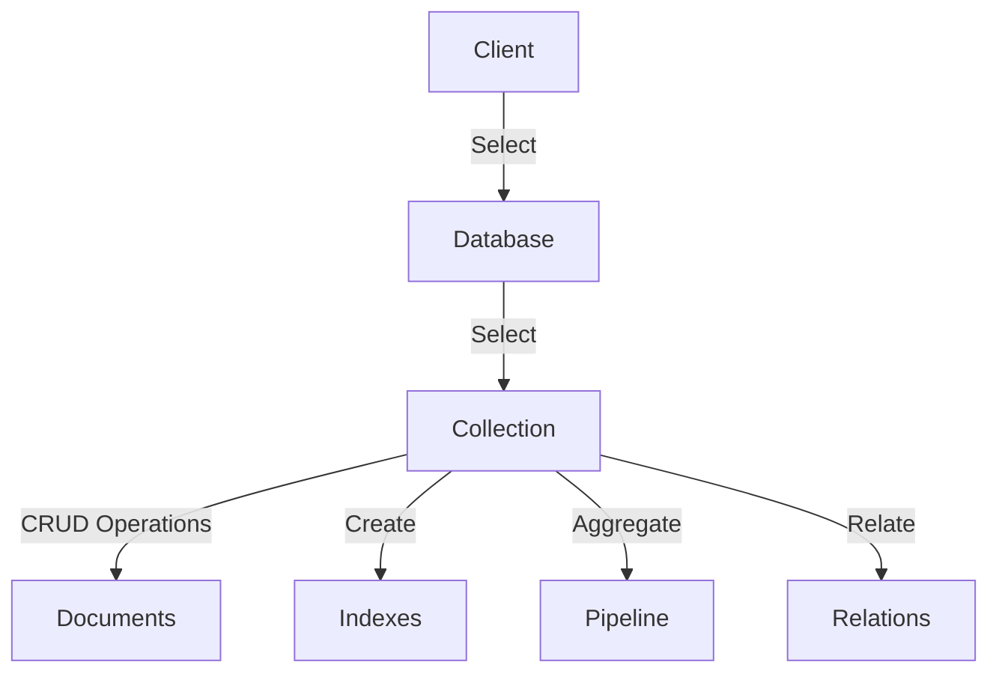

# MongoLike - MongoDB-like Interface for SQLite



## Overview

MongoLike adalah paket PHP yang menyediakan antarmuka mirip MongoDB untuk SQLite, dengan dukungan penuh PHP 8+ dan fitur canggih seperti agregasi, indeks, dan relasi data. Paket ini memungkinkan pengembang menggunakan sintaks MongoDB pada database SQLite tanpa memerlukan server MongoDB.

## Fitur Utama

### 📊 **Operasi CRUD**

- Insert, update, delete, dan query dokumen dengan sintaks MongoDB

- Dukungan callback dan kriteria array untuk query

### 🌀 **Agregasi Canggih**

Pipeline agregasi mendukung operator:

- `$match`, `$group`, `$sort`, `$limit`

- `$lookup` untuk join antar koleksi

- `$project` untuk seleksi field

### ⚡ **Manajemen Indeks**

- Pembuatan indeks untuk optimasi query

- Dukungan indeks unik dan komposit

- Akses metadata indeks

### 🔗 **Relasi Data**

- Relasi antar koleksi dengan `relate()`

- Operasi attach/detach dan sinkronisasi

## Instalasi

```bash

composer require herdianrony/mongolike

```

Jika mengalami masalah:

```json
// Tambahkan di composer.json

{
  "repositories": [
    {
      "type": "vcs",

      "url": "https://github.com/herdianrony/mongolike"
    }
  ]
}
```

Kemudian:

```bash

composer require herdianrony/mongolike:dev-master

```

## Penggunaan Dasar

### 🔌 Inisialisasi Client

```php

use MongoLike\Client;

$client = new Client(__DIR__.'/data');

$db = $client->selectDB('mydb');

$collection = $db->selectCollection('users');

```

### ✨ Operasi CRUD

```php

// Insert

$id = $collection->insert([

'name' => 'John Doe',

'email' => 'john@example.com'

]);

// Find

$user = $collection->findOne(['email' => 'john@example.com']);

// Update

$collection->update(

['_id' => $id],

['name' => 'Johnathan Doe']

);

// Delete

$collection->remove(['_id' => $id]);

```

### 🧩 Contoh Agregasi

```php

$results = $orders->aggregate([

['$match' => ['status' => 'completed']],

['$group' => [

'_id' => '$product_id',

'totalSales' => ['$sum' => '$quantity']

]],

['$sort' => ['totalSales' => -1]],

['$limit' => 10]

]);

```

### ⚙️ Manajemen Indeks

```php

// Buat indeks

$products->createIndex('price');

// List indeks

print_r($products->listIndexes());

/* Output:

[

[

'name' => 'idx_price_65a3b1',

'field' => 'price',

'type' => 'INDEX'

]

]

*/

```

## Contoh Lengkap

```php

use MongoLike\Client;

$client = new Client(__DIR__.'/data');

$db = $client->selectDB('ecommerce');

// Setup collections

$products = $db->selectCollection('products');

$orders = $db->selectCollection('orders');

// Insert produk

$productId = $products->insert([

'name' => 'Laptop Pro',

'category' => 'electronics',

'price' => 1200

]);

// Buat relasi

$relation = $products->relate('orders', 'product_id');

// Tambahkan order

$relation->attach(

['_id' => $productId],

['customer' => 'john@example.com', 'quantity' => 2]

);

// Agregasi: Total penjualan per kategori

$report = $products->aggregate([

['$lookup' => [

'from' => 'orders',

'localField' => '_id',

'foreignField' => 'product_id',

'as' => 'orders'

]],

['$project' => [

'name' => 1,

'category' => 1,

'totalOrders' => ['$size' => '$orders']

]]

]);

print_r($report);

```

## Struktur File

```

mongolike/

├── src/

│   ├── Client.php

│   ├── Database.php

│   ├── Collection.php

│   ├── Cursor.php

│   ├── Aggregation.php

│   ├── IndexManager.php

│   ├── Relation.php

│   └── Util.php

├── composer.json

├── README.md

└── LICENSE

```

## Dukungan & Kontribusi

- [Lapor Issue](https://github.com/herdianrony/mongolike/issues)

- [Buat Pull Request](https://github.com/herdianrony/mongolike/pulls)

- Persyaratan: PSR-12 dan unit test

## Download Manual

```bash

git clone https://github.com/herdianrony/mongolike.git

cd mongolike

composer install

```

## Persyaratan Sistem

- PHP 8.0+

- Ekstensi PDO

- Ekstensi JSON

- SQLite 3.8.3+

## Lisensi

**MIT License** - Lihat [LICENSE](LICENSE) untuk detail lengkap.
